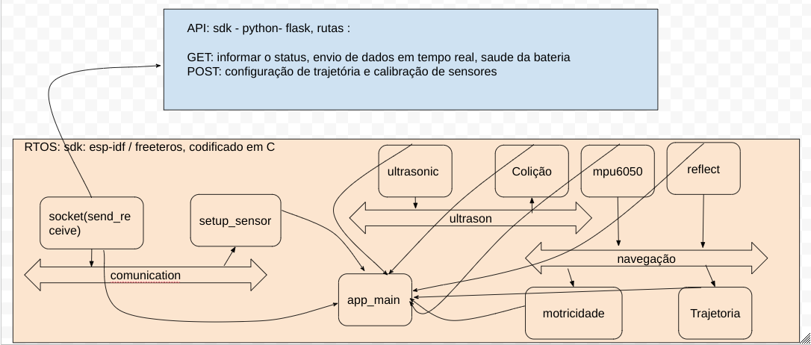

# Iot Device Gateway - IoT  Navigation System
A [rtos](https://docs.espressif.com/projects/esp-idf/en/latest/esp32/api-reference/system/freertos.html) navigation system based on HTTP request. Developed with my computer engineering students at the [FIAP](https://www.fiap.com.br/) university - São Paulo, Brasil.

- [Setup](#local-setup)
- [Development](#development)
- [Contribution Guide](#contribution-guide)


## Local Setup

The hardware used id a robotic kit provided by [robocore](https://www.robocore.net/), and the sensor MPU6060:


The controller is an esp32 embedded on board VESPA developed by robocore for robotic projects, and the the follow diagram details the  pinout:


It is necesary to install the [esp-idf] on your computer, we recomend using the vscode plugin.

The requirements about the system are:
```bash
- Full control based on HTTP request.
- Multithreading API requisitions.
- Navigation based on lineal translation.
- Trajectory based on inercial aceleration.
```
The code strategy are listed below:


## Contribution Guide

You will need to create a new branch, follow this convention:

```bash
<turma>_<checkpoint>_<rm>
```
for example:

```bash
5ECR_Checkpoint2-A_rm3456
```

Create a Pull Request and add me to revise and aprove the features/changes.

## Checkpoint2-C (2 ptos) - due 13/10 00:00

At this time we have setup the analogic read from one channel, refer to one sensor, we will need to add the follow features:

```bash
add the ADC1_CHANNEL_3 support to the existing function, use structure to get the two analogic read and send/recive on the quee.
```

```bash
Refactor the code of the mpu sensor(checkpoint 1) and add this to the project like a module.
```
